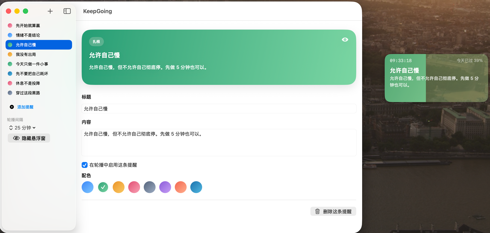

<p align="center">
  
</p>

<h1 align="center">KeepGoing</h1>

<p align="center">一个为当前阶段设计的 macOS + iOS 提醒应用。</p>

<p align="center">
  
</p>

## 已实现

- **悬浮提醒窗** — 常驻最上层的紧凑挂件（280x130），整个面板就是一天的进度条
- **时间感知** — 跳动的秒数、日进度百分比、随时段变化的色温（清晨暖黄 / 正午原色 / 傍晚橘紫 / 深夜深蓝）
- **3 种动画效果** — 呼吸光晕（心形脉搏）、进度脉搏（分界线呼吸）、粒子漂移（沙漏沙粒），用户可选
- **8 种配色** — 天空、翠叶、琥珀、玫瑰、石板、薰衣草、珊瑚、深海
- **自动检查更新** — 启动时查 GitHub Releases，有新版本弹窗提示下载
- **轮播切换** — 可配置间隔自动轮播提醒
- `macOS` 常规窗口管理和编辑提醒内容
- `macOS` 菜单栏快捷入口
- `iOS` 编辑界面，共享同一套提醒逻辑
- 本地持久化所有设置

## 安装

从 [Releases](../../releases/latest) 下载最新 DMG，打开后将 KeepGoing 拖到 Applications。

如果 macOS 提示无法打开，在终端执行：

```bash
xattr -cr /Applications/KeepGoing.app
```

## 从源码构建

1. 用 Xcode 打开 `KeepGoing.xcodeproj`
2. 选择 `KeepGoing_macOS` 运行到 Mac
3. 选择 `KeepGoing_iOS` 运行到 iPhone Simulator

## 这版的边界

- 还没有接入 `iCloud` 同步
- 还没有 `Widget`
- 还没有系统通知和定时提醒

## 适合下一步加的功能

- `iCloud / CloudKit` 同步
- `macOS / iOS Widget`
- 每日固定时间自动切换提醒
- 从你的 Obsidian 日记自动导入一句"今日提醒"
